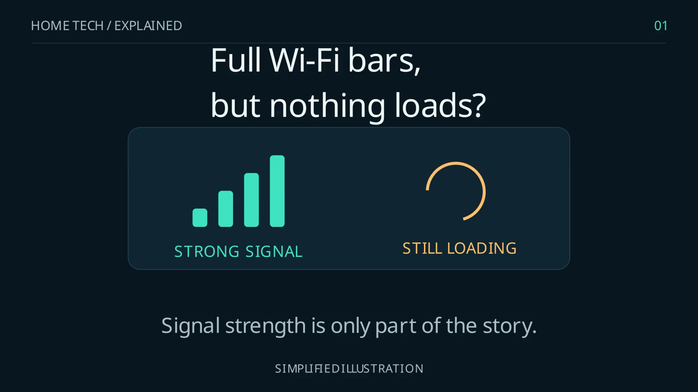

# Vexon IT · Selected work

Practical software, reliable local systems, and technical explanations by **RJ Garza Jr** in the Rio Grande Valley, Texas.

[Business website](https://vexonit.com/) · [Partnership inquiries](PARTNERSHIPS.md) · [Project evidence](docs/project-evidence.md)

## Watch the work

**[Watch or download the 46-second explainer](https://github.com/reap3risgodawful/vexon-it/raw/refs/heads/main/examples/wifi-vs-internet/landscape.mp4)** · [Source and reproduction notes](examples/wifi-vs-internet/README.md)

An original, caption-led explanation of why full Wi-Fi bars do not prove internet access. Created in Python with Manim, with separately composed landscape and portrait editions. Both exports passed complete frame decoding: **2,520 frames total**, H.264 video, 30 fps, and silent AAC audio. The diagram is illustrative; this is a sample of technical communication.

## Try a free lesson

**[The domain cannot be found: a 10-minute Active Directory troubleshooting exercise](lessons/ad-domain-discovery/README.md)**

Use a fictional helpdesk ticket to compare DNS evidence, choose a scoped fix, and write a clear validation note. Includes an answer and self-check. No installation, signup, or purchase required; this is a paper exercise, not a recorded Windows lab test.

## Selected projects

| Project | What I built | Evidence |
| --- | --- | --- |
| **Technical video production** | Original animations, captions, separate 16:9 and 9:16 layouts, repeatable rendering and export checks. | [Playable sample, source and verification](examples/wifi-vs-internet/) |
| **Private operations and recovery** | Local-assistant request handling, authenticated service access, camera freshness checks, health reporting and verified encrypted restores. | [Dated acceptance results and scope](docs/project-evidence.md#private-home-operations-reliability-local-inference-and-recovery) |
| **Vexon IT Field App** | A mobile-oriented HTML/CSS/JavaScript reference app with guide drawers, clipboard actions and a browser-local planning tracker. | [Source](index.html) · [Implementation notes](docs/project-evidence.md#vexon-it-field-app-a-mobile-oriented-reference-prototype) |

## Collaboration

I am interested in scoped technical content pilots, practical product documentation, field-reference tools, and reliability or recovery projects. A useful starting point is one audience, one problem, an agreed deliverable, and clear acceptance criteria.

See [partnership options and contact details](PARTNERSHIPS.md).

## Working with this repository

The original `index.html` field app is preserved. It is a prototype: use fictional records. Its browser storage and input handling have not been reviewed for real customer data, and it does not process payments or verify income.

The private operations case study shares outcomes and validation methods without publishing deployment configuration or private records. Dated tests describe their tested scope; they are not an uptime guarantee or a claim of customer deployments.

No blanket license is granted for the original media or application assets in this repository. Contact RJ to discuss reuse, delivery, or licensing; third-party components retain their own licenses.
